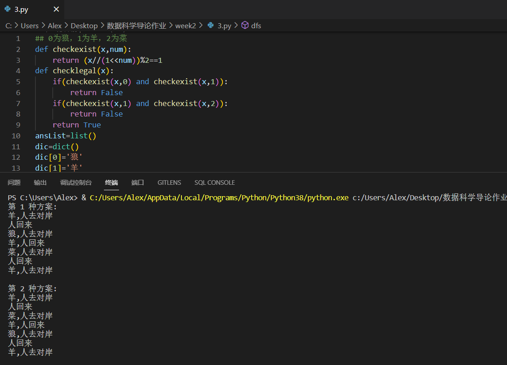
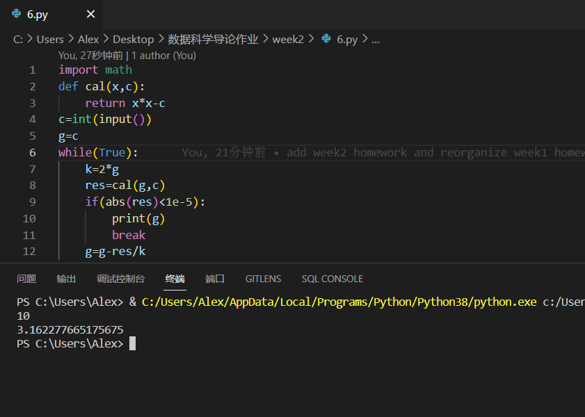
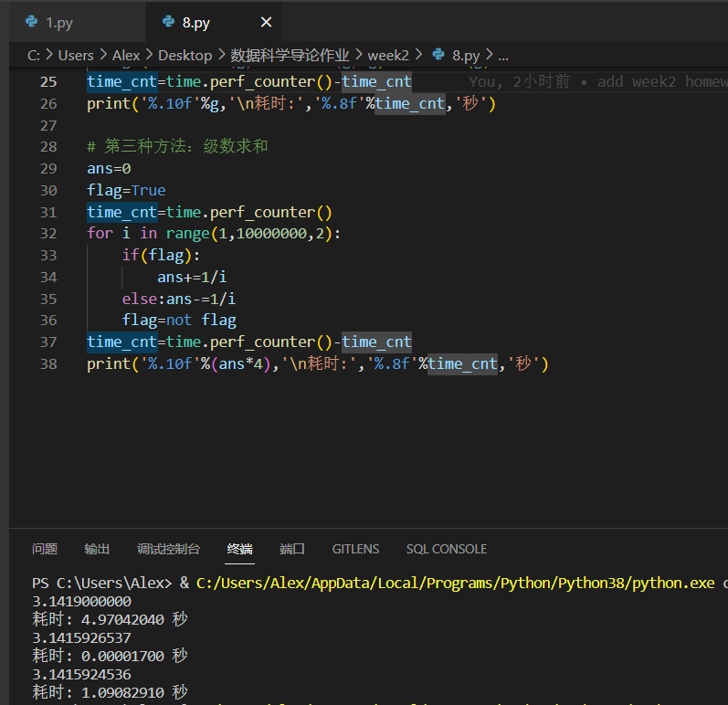

题目思路代码中均有写明

## 1.

#### (1):将2001全部拆分成3再相乘

#### (2):可证当我们把5以上的数拆分成一个数列相乘时，若数列中含有x，则表示x自身无法再拆成更优的数列相乘。接下来证明x必定小于等于四：

#### 当x大于4时，x拆成(x-2)\*2可得2\*x-4,因为x>4,所以易证2\*x-4>x，所以x大于4时总可以将其拆成更优的数列相乘。接下来证明当x可拆成3个及以上的2时会优先拆成3

#### 6=2+2+2=3+3，2\*2\*2=8<3\*3=9，所以每3个2可以转化为2个3。并且易证，我们永远不会把一个大于1的数拆出1并且乘以1，这比原本的数还会小，所以我们可以得到：将x拆分成若干个2和3最优，并且2的数量不超过2

#### 易证此时方案数有且只有一个，即先将x整除3得到3的数量，若余数为1则舍弃一个3以得到4，转化成2个2；若余数为2则保留这个2，若余数为0则不乘2。注意x等于1的情况需要特判，直接输出1。

## 2.

#### 其实还好，因为每次加10等于乘一个1024

## 3.

#### 考虑dfs来遍历所有情况，并且因为诸如“人带着狼过岸之后人再带着狼回来”等情况是无效情况且会导致无限递归，所以考虑采用使用set来记录已经到达过的所有状态数。因为题目中一共有两个岸，三种物品，和一个船，船的位置要么在第一个岸要么在第二个岸，因此考虑使用状态压缩来表示三种物品的情况，情况上限为2\*2\*2=8种，因此考虑两个岸加一条船的情况可以用第一个岸的状态\*100+第二个岸的状态\*10+船的状态这样一个哈希函数来表示整个状态，这样表示不会产生哈希冲突并且很容易在set里进行比较和插入。

#### 同时，考虑最后题目要求输出所有合法路径，因此使用list来记录路径。

#### 因此我们可以造出我们的dfs函数，变量为当前的第一个岸状态，第二个岸状态，船位置，已经历过状态的set，和记录路径的list。

#### 在dfs函数开始我们需要先考虑此时的状态是否合法。因为船正在某岸时表明人此时也到了这个岸，那么无论狼羊菜在这个岸上是什么状态都是合法的。相反，另外一个岸上没有人，因此要检验另外一个岸上是否有非法情况出现，有则退出函数。检测是否合法只要检测对应岸的二进制表示中是否同时含有狼和羊的位置或者同时含有羊和菜的位置即可。

#### 同时，若当前状态能够在set中找到，则无意义，此时也退出函数。若当前状态为对岸为1+2+4=7且船也在对岸，则说明找到一个合法路径，将其放入全局链表 ansList中即可。

#### 如果上述条件都不满足则遍历当前船所在岸的三个二进制位，分别尝试将每个为1的位用船运至对岸。即调用dfs函数。值得注意的是要先给本体set和list做个copy再加元素，因为python函数的set，list是默认传址的。

#### 

## 4.

#### 没啥好说的，二分解决

#### 

## 5.

#### 事实上对于任意正数c，g只要取正数，通过牛顿法都能趋近于根号c，因此不管是g=c/2,g=c,g=c/4都能求出正确答案。

## 6.

#### 和上题一样

## 7.

#### 和上题一样使用牛顿法，求出x\*x\*x-c的导数和其切线表达式，即可写出g的转换式子

## 8.

#### 使用了蒙特卡洛，牛顿法，级数求和三种方法，可以看出牛顿法完胜，其逼近正确值的速度实在太快，一下子就可以满足精度要求。而级数求和苦于计算的项数过多而时间较大，不过1e+7的数据量跑一秒也还可以接受。而蒙特卡罗方法不但拥有1e+7的随机数据量并且random产生常数本身仍是个比较耗时间的过程，所以跑了4秒钟，并且精度不如其他两者高。

## 9.

#### 没啥好说的，蒙特卡洛模拟解决

