## 第三章

### 1.

把x不断分为若干种2的i次方的和即可，i从大到小遍历直至x减为0

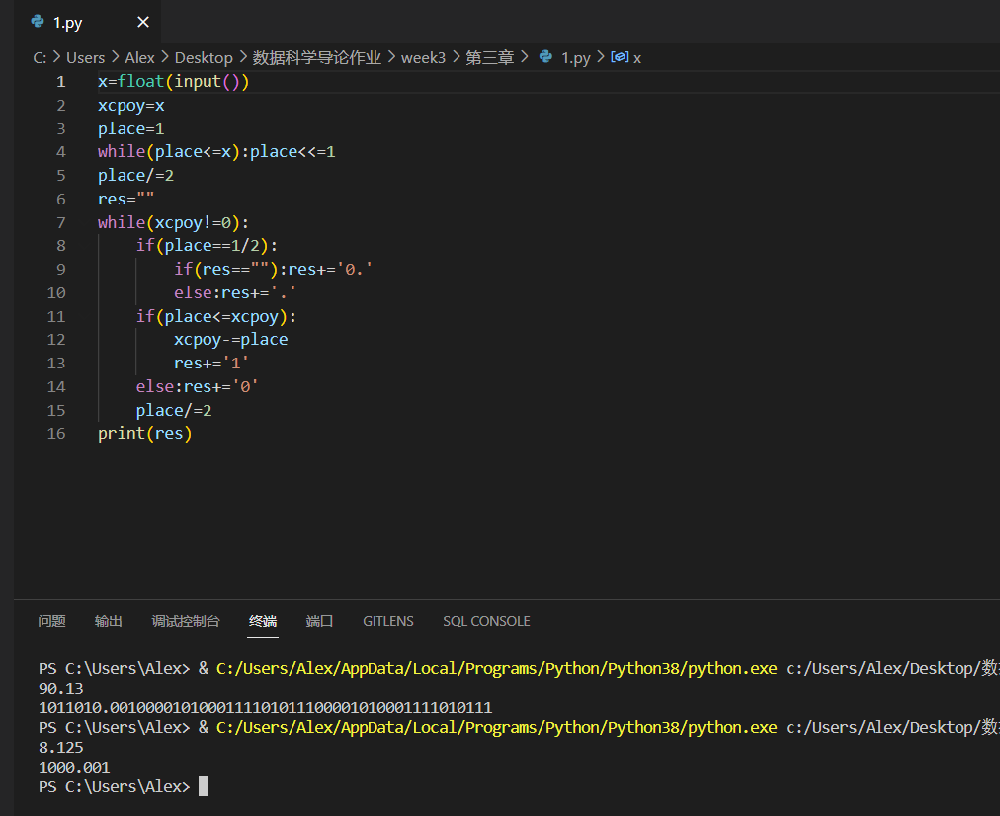

### 2.

random一下即可

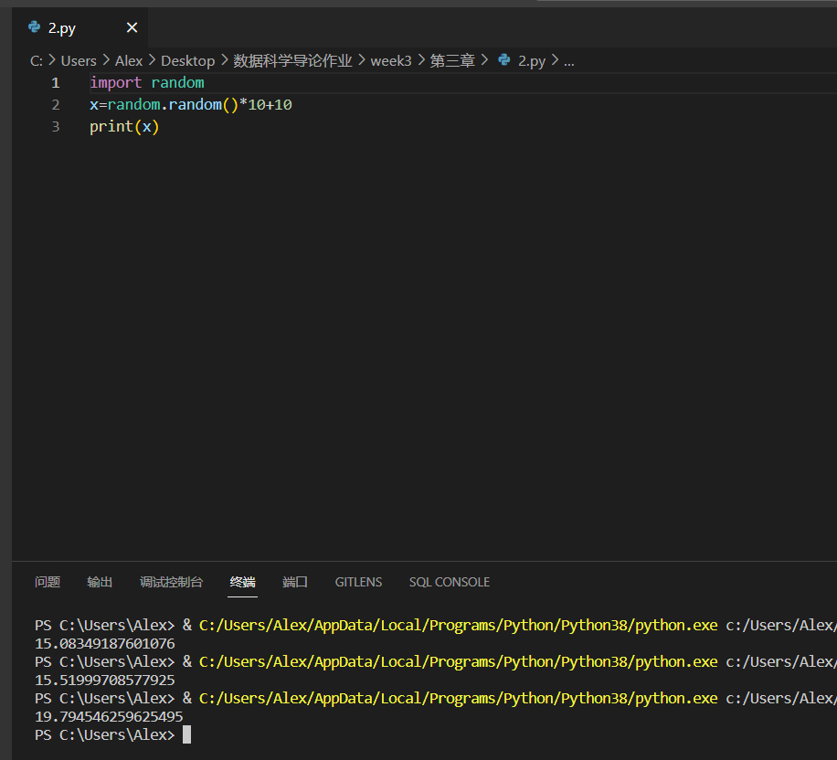

### 3.

正则表达式判断一下即可

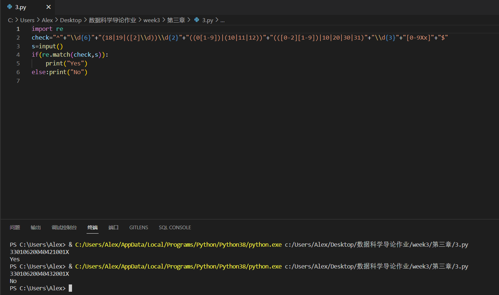

### 4.

模拟链表实现增删改查，我的删除函数仿照c++ stl容器中的erase(find)，每次只删除找到的第一个查找元素；更改函数则是将链表中所有符合值x的元素更改为值y；查找功能则返回是否查到，查到则true，查不到则false

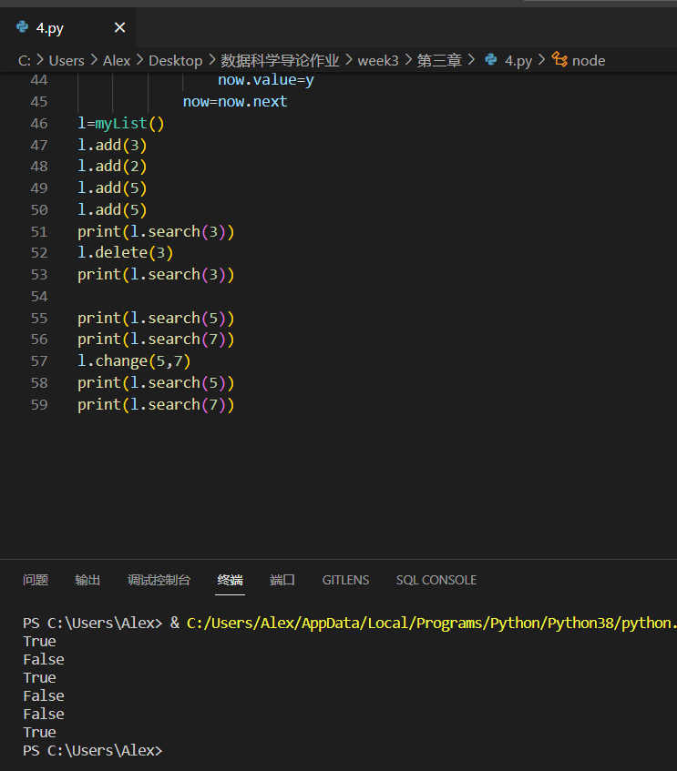

### 5.

循环一下即可

### 6.

if判断一下即可

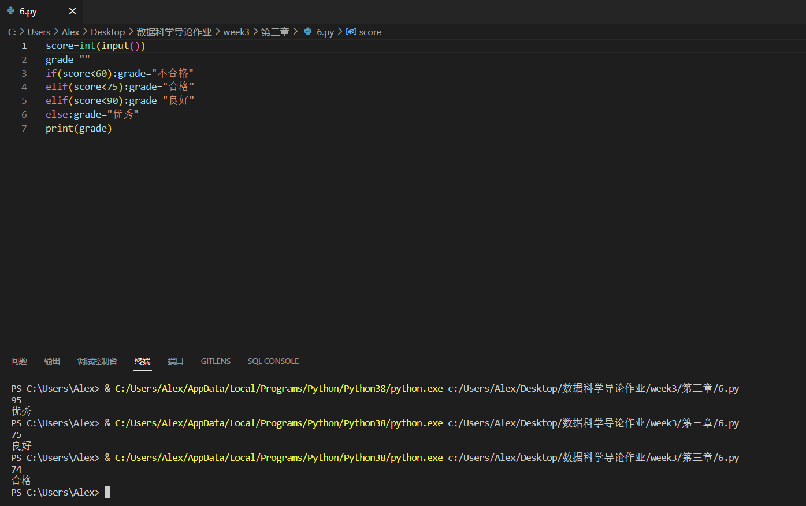

### 7.

先求一遍x的所有因数，再找一遍y的所有因数，将其重合部分累计相乘得到最大公因数，再用x*y除以最大公因数得到最小公倍数

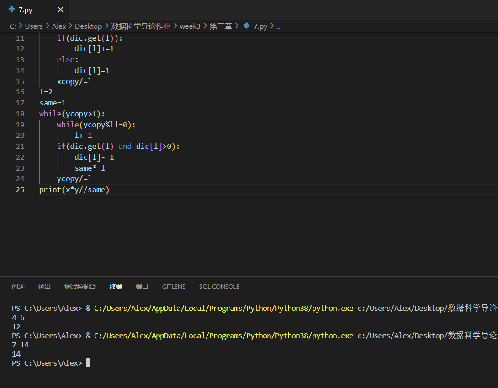

### 8.

随着数据量增大，时间上的差距越来越明显(快速排序nlogn薄纱选排n\^2)，本来数据量是每次加5000，但是这样数据量到1e+4以上之后n^2复杂度就太差了...

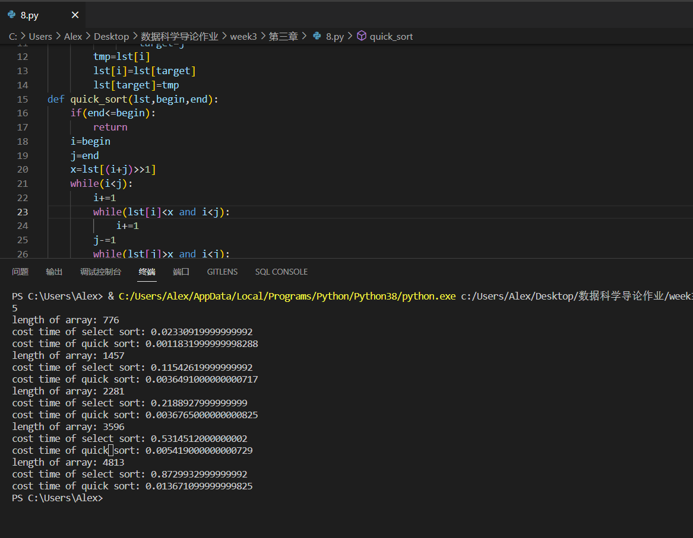

###  9.

分别写一个前缀后缀数组维护前缀积和后缀积即可

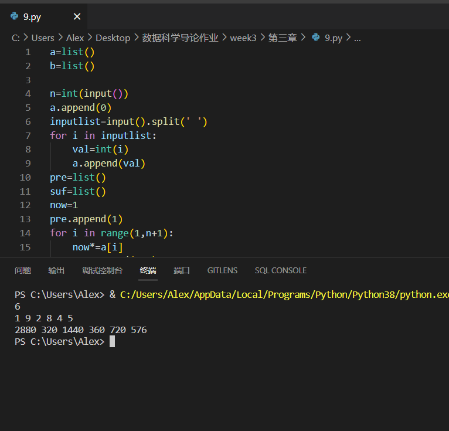

## 第四章

### 1.

对1e+14一下的数据采取最质朴的判断方法，即从2~sqrt (n)依次看是否是n的因数，对1e+14以上的数据采取acm中会使用到的miller-rabin随机算法（又称光速幂），在(logn)^3复杂度内判断是否是素数。我选的几个测试素数可以保证对1e+18以内的数据是绝对正确的，对1e+18以上的数据有99.9%以上的概率是正确的。

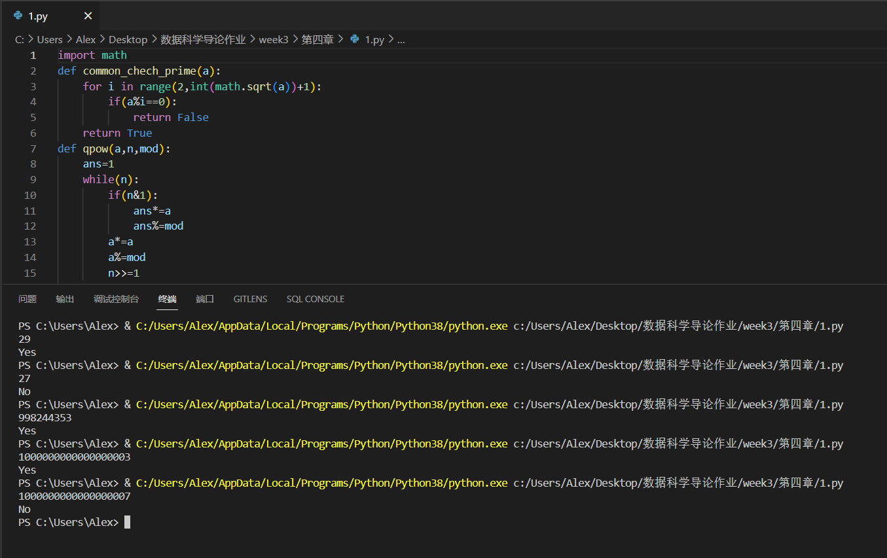

### 2.

没啥好说的，上周和这周的作业里都已经用到过了

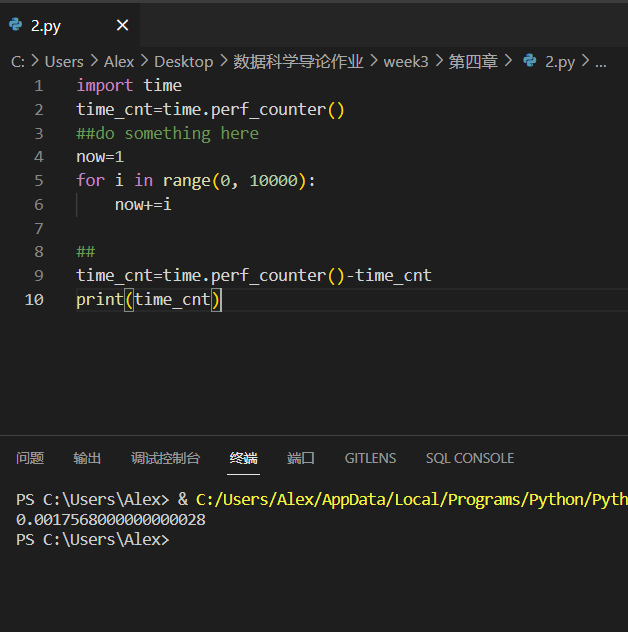

### 3.

如图：

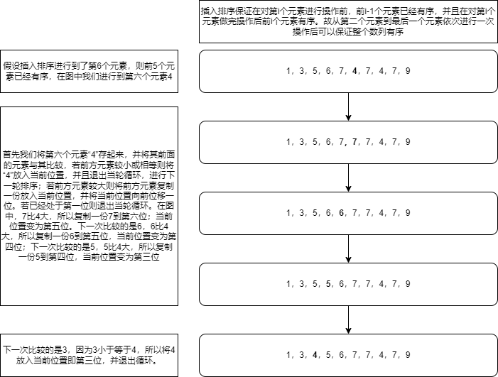

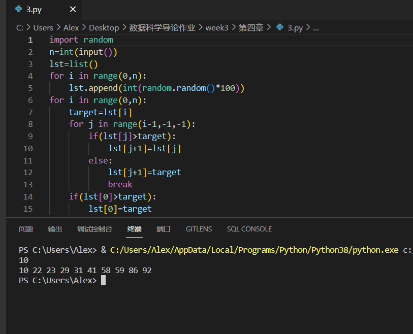

### 4.

空间复杂度显然为O(n)，只需要最基本的存n个数即可。时间复杂度为O(n^m),1<m<2,m取决于gap的变化间隔

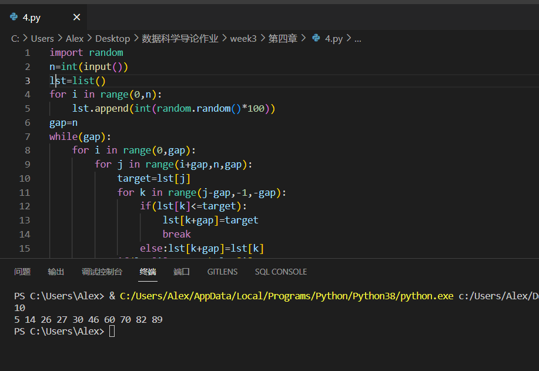