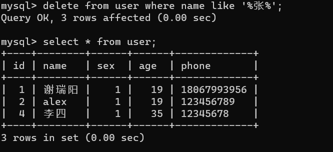

## 1-1.

将写入csv改为写入mysql即可，使用pymysql库连接本地数据库，再使用cursor执行sql语句。数据库部分结果如下：

## 1-2----1-5.

按照ppt教程与网上资料安装了scrapy（第2题），进行了简单的模板运行（第3题），对整个当当网计算机类书籍网页进行爬取（第4题），以及对计算机类书籍网页上的书籍相关信息进行爬取并记录到数据库中（第5题）。

第3题的结果在文件夹week5\mySpider\mySpider中的teacher.html中，第4题的结果在文件夹week5\mySpider\mySpider的dangdang.html中

在第五题中，将数据以item形式输入到管道（pineline）中，再在pineline中对item进行处理并将数据提交到数据库中。运行以及数据库中结果如图：

## 2-1~2-3:

此前已安装使用过mysql数据库，故使用mysql数据库。创建了user表，初始内容如下：

## 2-4.

## 2-5：

## 2-6（已经将上题中的数据插入回数据库用于测试）：

## 2-7：

## 2-8：

## 2-9.

使用内连接与左连接（其实都用内连接也可以）来处理数据取交集操作。

## 2-10.

