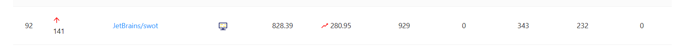
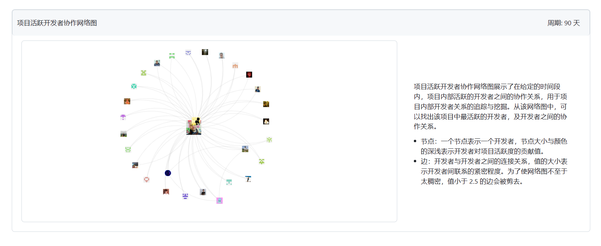
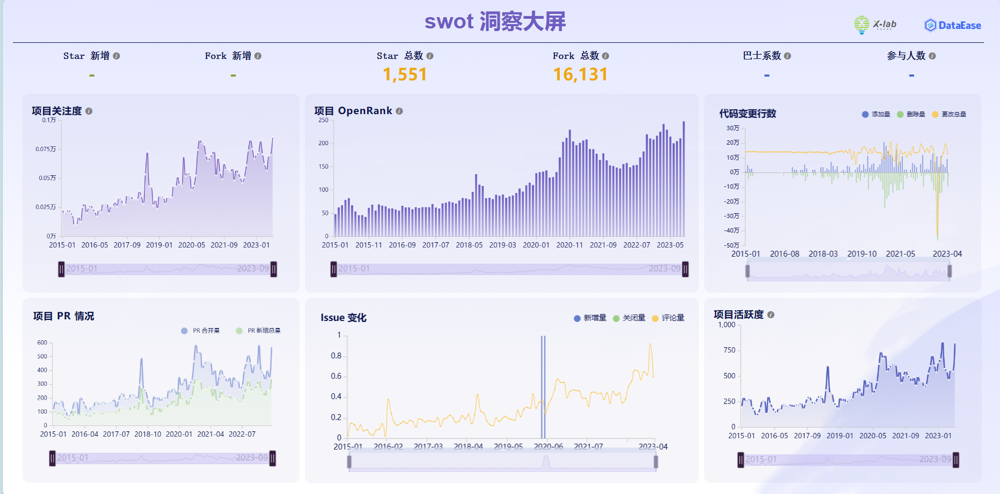
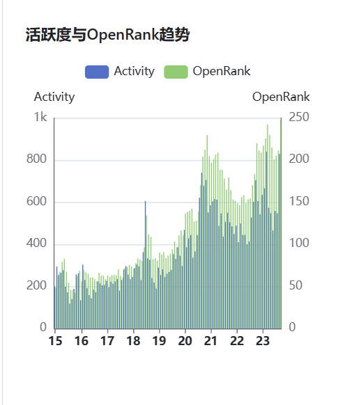

## 观察项目：jetbrain/swot

### 项目链接：https://github.com/JetBrains/swot

在Open leaderboard中位于全球榜第92，仓库内容为用于认证jetbrain学生及老师邮箱账户的项目，开源的主要目的是让各大高校及学术机构自行将邮箱后缀以路径加文件名形成的txt方式添加至仓库中以实现自动化管理免费使用jetbrain产品的学术邮箱。

### 用户关系图：

实际上仓库的很大一部分贡献者是来自不同学校的管理人员，而且大多数人对仓库的贡献是一次性的。这在下面的贡献关系图中能够直观的看出该特性。

关系图外层分布的主要是大学老师等角色，主要是提交一次学校的邮箱格式就不会再对仓库进行贡献。

中间的用户为JetBrains大学关系经理Philip Torchinsky，本仓库主要由他来管理。

### 仓库热度图：

由于jetbrain的产品近年一直火爆，如Intellij IDEA，Clion，Pycharm等，所以一直有新的学术机构将邮箱后缀添加至该仓库中，因此该仓库的热度，关注度也总体成上升趋势。

从代码变更图中可以看出，在2023年初项目可能经历了一次结构变更，删除了许多代码。

从各张图中都能看出在2018年中后期提交更新jetbrain学术邮箱的人数有一次短暂但显著的爆发期，可能是受某个产品的重大更新影响(?)，但是经过查看jetbrain2018的年度报告可以得知他们这一年好像并没有什么重大的创新...也有可能是2017年发布的GoLand和Rider两款产品的厚积薄发的影响。

