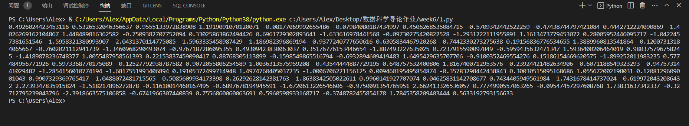
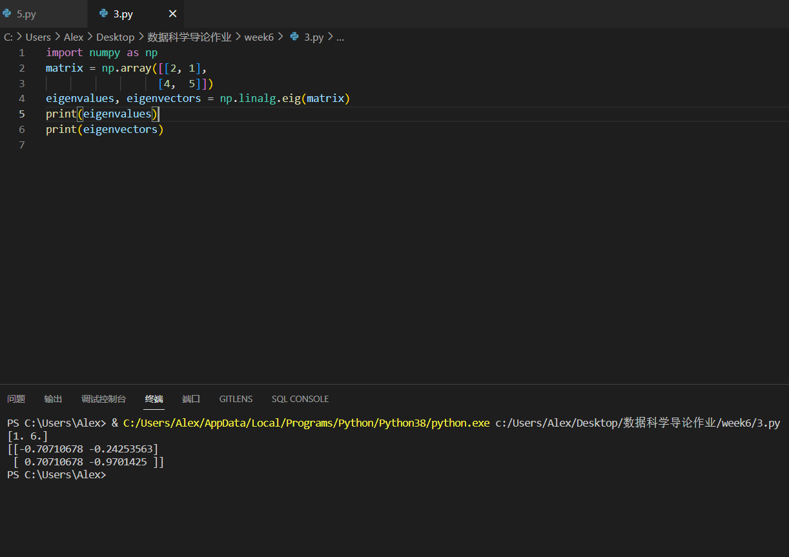
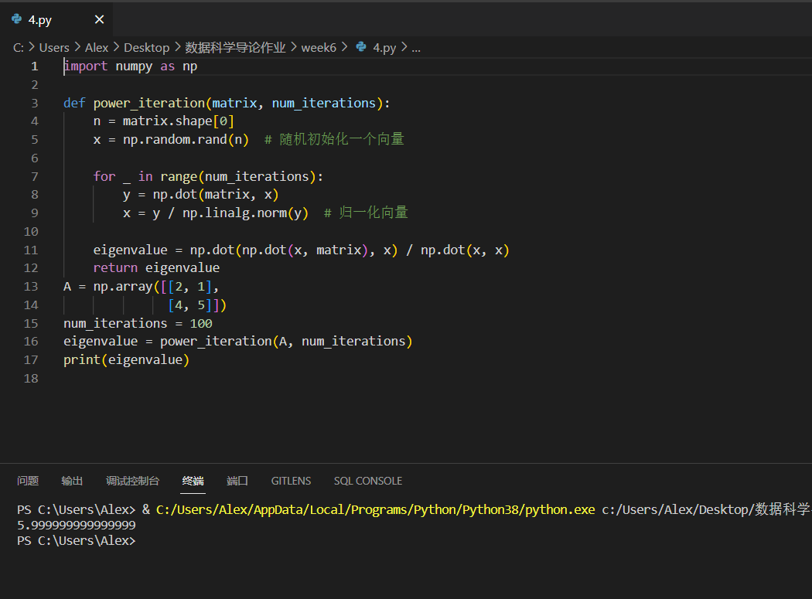
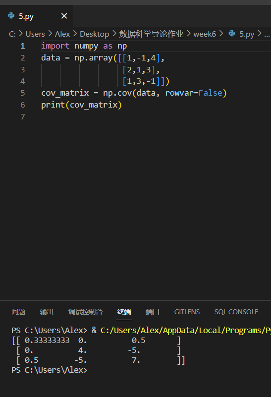
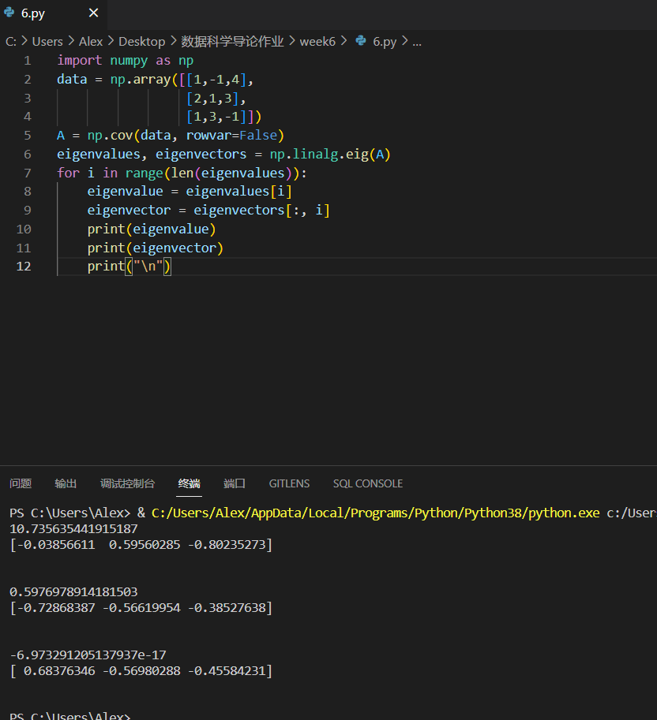

## 报告

### 1.

使用numpy自带的随机生成符合标准正态分布的函数生成数据

### 2.

使用和上题一样的方法生成数据，然后使用seaborn库中的函数来生成数据的密度曲线，注意，由于只取了100个数据，生成的曲线有时候并不和标准正太分布一样完全对称。通过把100改成1e5，1e6后生成的曲线有明显的质量提升。

### 3.

使用numpy中的计算矩阵特征值与特征向量的函数进行计算

### 4.

使用numpy中的dot函数进行矩阵乘法运算，以进行幂迭代法计算极大特征值

### 5.

使用numpy中的cov函数来计算协方差矩阵

### 6.

由于通过多方搜索并未查到使用幂迭代法计算矩阵所有特征值以及特征向量的方法，所以使用函数np.linalg.eig来计算协方差矩阵的所有特征值和特征向量。

